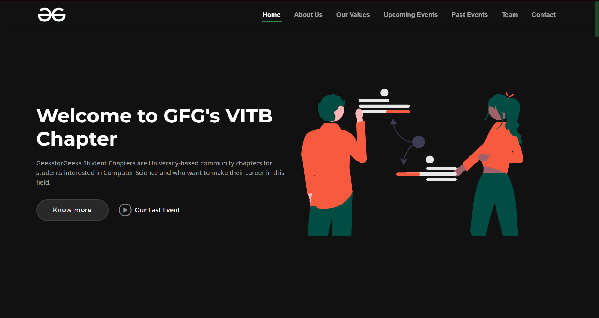

# GFG Student Chapter - VIT Bhopal Website

## Task 1: Create a website for GFG Student Chapter at VIT Bhopal

- **Responsive Design:** The website is built to be responsive, ensuring that it looks great and functions well on various devices, including desktops, tablets, and mobile phones.

- **Attractive Front-end Design:** The front-end design of the website is thoughtfully created to catch the user's attention and provide a visually appealing experience.

- **Well-Structured Content:** The content on the website is organized and structured to make it easy for visitors to find the information they are looking for, such as upcoming events, recent activities, and chapter updates.

- **Events and Activities:** The website features a dedicated section to highlight the upcoming events, workshops, seminars, and other activities organized by the GFG Student Chapter.

- **Chapter Information:** Learn about our chapter's mission, goals, achievements, and the team of dedicated individuals who are driving the chapter's initiatives.

- **Contact Information:** Visitors can easily get in touch with us through the contact form provided on the website. Additionally, our social media handles are listed for further engagement.

